## 概述

9月29日 Compound的62号提案正式实施,`Unitroller`代理合约指向了新的逻辑合约`Comptroller`,
该逻辑合约引入了巨大的奖励分发BUG,1亿4千万美金的CompoundToken受影响，
光荣地冲到了Rekt排行榜第二的位置.

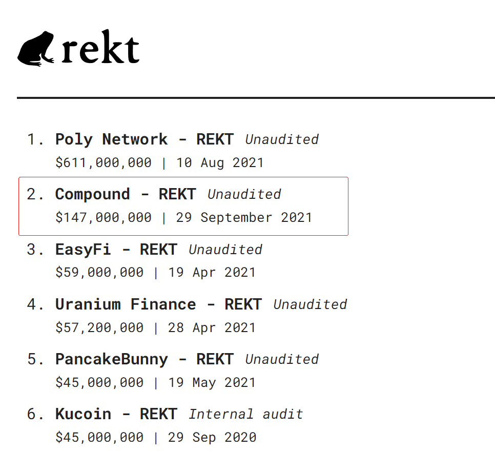

事件发生后, Compound紧急提出了63号提案,试图暂停所有奖励发放, 大股东`A16z`秒投赞成票,而UC Berkeley的区块链实验室则投了反对票.


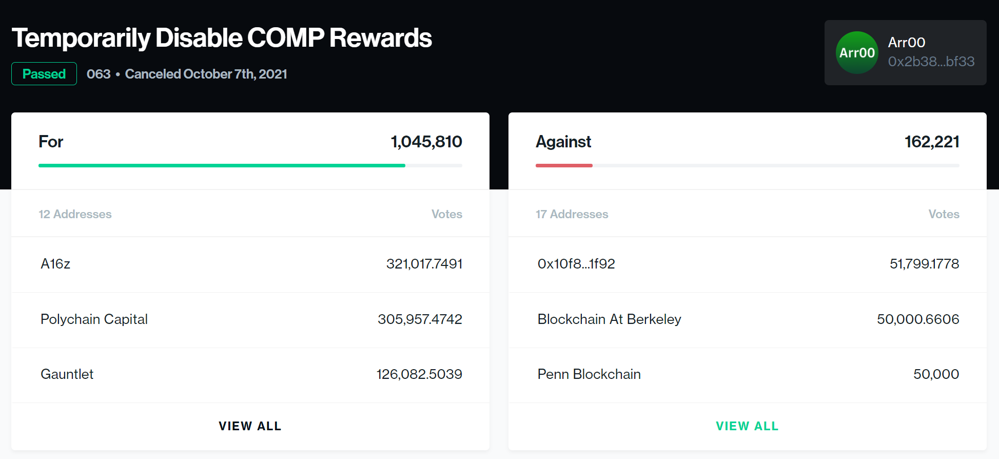

* 一开始我还以为这只是一家坐落在伯克利的投资机构，但是这个`edu`的根域名可太秀了
```
https://blockchain.berkeley.edu/
```

但即使这一提案通过也无法弥补过失,Compound的负责人承认一个提案最快落实也要一周的时间


* 时间锁允许的最短时间为2天

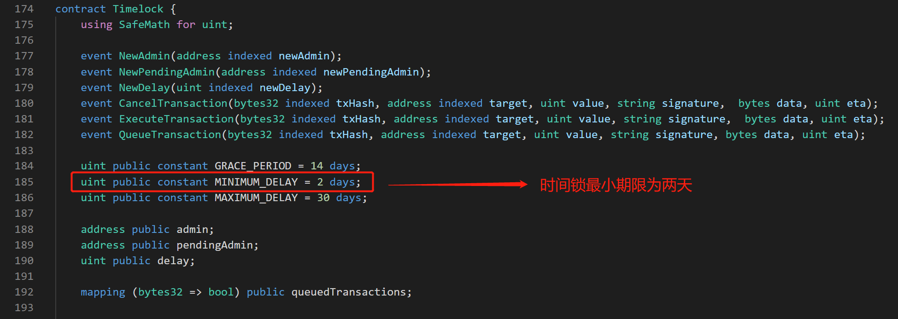

Odaily星球日报的分析
```
https://www.chainnews.com/articles/720659876649.htm
```
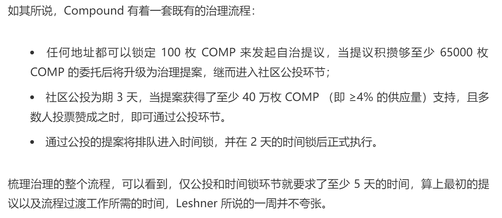

更可怕的是, 其负责人声称,仅`Comptroller`合约中的少量Token受影响, 大部分保存在`Reservori`合约中的Token是安全的

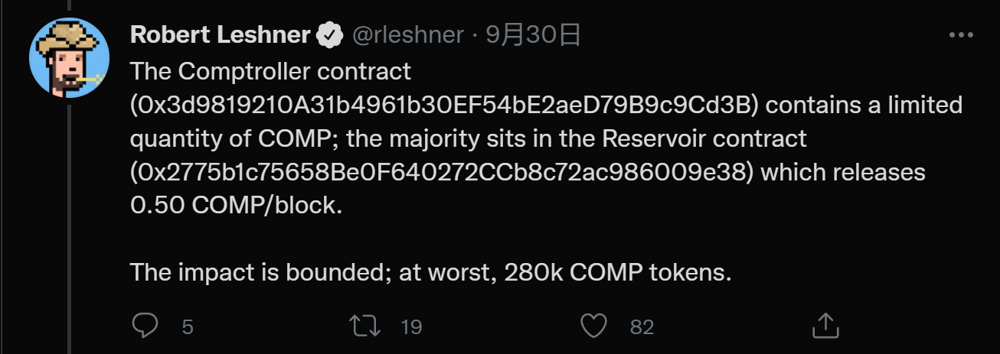

但事情并不是这样, 10月3日,有人通过调用`Reservori`合约的`drip()`函数,把20万 Token 转入了`Unitrooler`合约.

* 10月3日 触发Reservoir的Drip() 把Comp打入`Unitrooler` 交易hash

```
0x02ba168f4d4fc313d095e9f0711447e8b96b26421539bd40be58243cd80a73cd
```

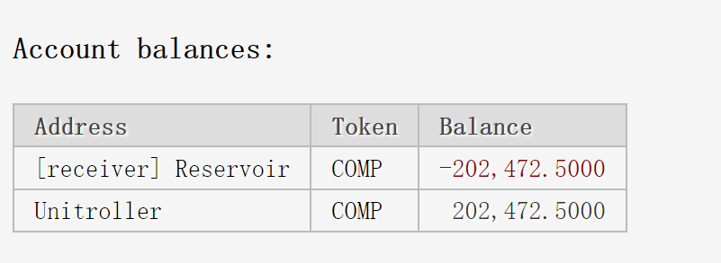

于是受损金额达到了上亿美金.

Compound 负责人在社交媒体上请求用户返还异常发放的Token


但返还的人并不多

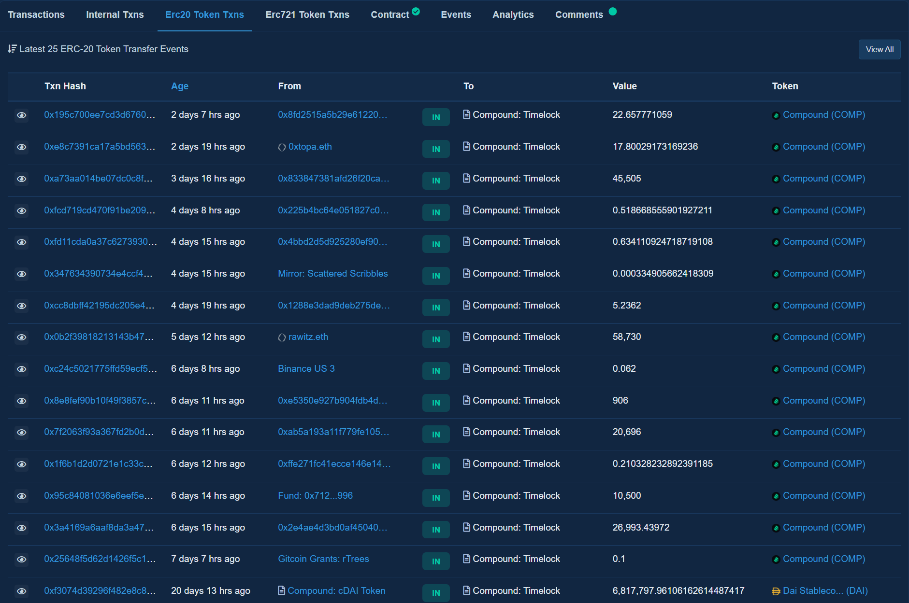


## 代码分析

62号提案所增加的功能为`_InitializeMarket()`,对那些并不能获得奖励的质押Token进行了初始化,这些Token包括

* cTUSD、cMKR、cSUSHI、cYFI、cAAVE和cSAI

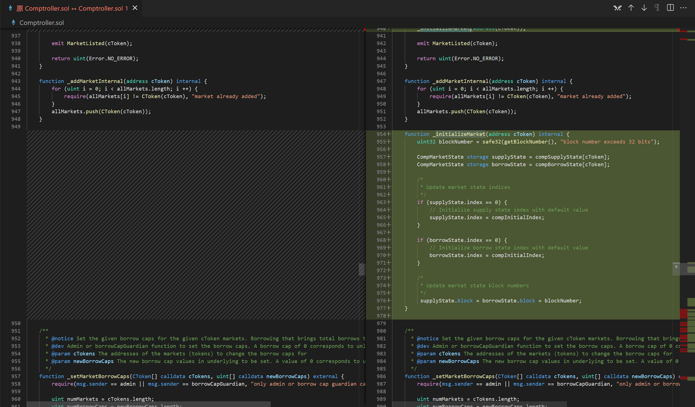


而在提案生效前曾与这些CToken合约交互过,并且手快的用户却可以领取巨额`Comp`奖励

9月30日 一名用户利用该BUG领取了22995个Comp 

* 交易hash
```
0xee318650ae8bcf83517e77e8654d40201990080fcb888087f737aea28e70bdb1
```


该用户调用了`Comptroller`合约的`claimComp()`函数

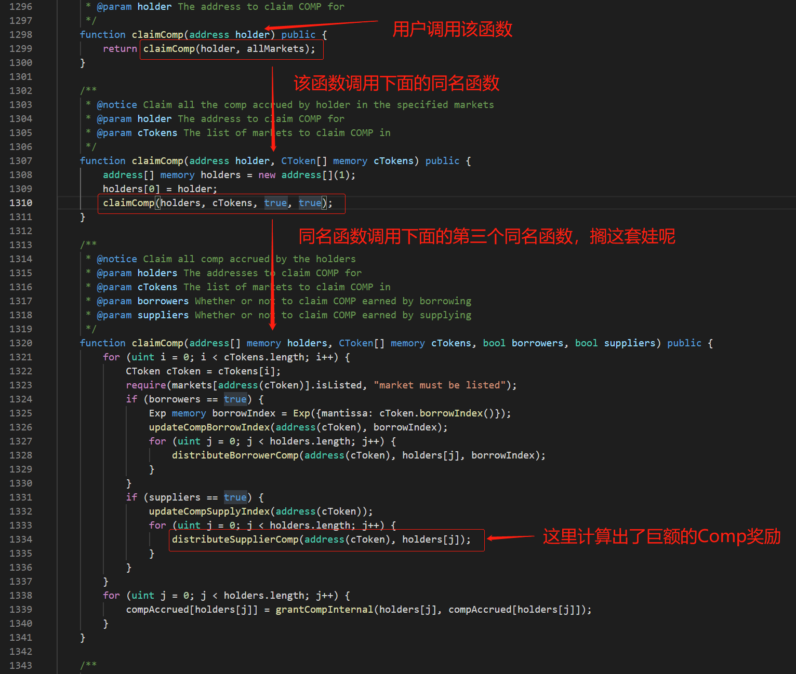

为了节省Gas和链上的存储空间,Dapp的奖励分发机制往往设计的比较抽象,难以理解
这里用简化版`SNX`的`StakingRewards.sol`做演示

```
// SPDX-License-Identifier: MIT
pragma solidity ^0.8;

contract StakingRewards {
    IERC20 public rewardsToken;
    IERC20 public stakingToken;


    // 奖励发放的速率
    uint public rewardRate = 100;
    
    // 上一次的更新时间
    uint public lastUpdateTime;

    // 当前池子中每个质押Token所获得的奖励 
    uint public rewardPerTokenStored;


    // 保存用户上一次与合约交互式时每个质押Token所获得的奖励
    mapping(address => uint) public userRewardPerTokenPaid;
    
    // 保存用户获得的奖励
    mapping(address => uint) public rewards;


    // 总供应量
    uint private _totalSupply;

    // 保存用户的质押的Token数量
    mapping(address => uint) private _balances;

    constructor(address _stakingToken, address _rewardsToken) {
        
        // 质押的Token
        stakingToken = IERC20(_stakingToken);
        
        // 奖励的Token
        rewardsToken = IERC20(_rewardsToken);
    }
    
    // 计算当前池子中每个质押Token所获得的奖励
    function rewardPerToken() public view returns (uint) {
        
        // 如果总供应量为0 则返回0
        if (_totalSupply == 0) {
            return 0;
        }

        // 当前池子中每个质押Token所获得的奖励 = ((当前时间 - 上次更新时间) * 发放速率 / 总供应量)        
        //                                    + 
        //                                   上一次池子与任意用户交互时每个质押Token所获得的奖励
        return
            rewardPerTokenStored +
            (((block.timestamp - lastUpdateTime) * rewardRate * 1e18) / _totalSupply);
    }

    // 计算用户获得的奖励
    function earned(address account) public view returns (uint) {

        // 用户获得的奖励数量 = 用户的质押Token数量 
        //                     * 
        //                    (当前池子中每个质押Token所获得的奖励 - 用户上一次与池子交互时每个质押Token所获得的奖励)/10**18) 
        //                     + 
        //                    用户上一次与池子交互时获得的奖励
        return
            ((_balances[account] *
                (rewardPerToken() - userRewardPerTokenPaid[account])) / 1e18) +
            rewards[account];
    }

    // 更新奖励发放比例
    modifier updateReward(address account) {

        // 更新当前每个Token该获得的奖励
        rewardPerTokenStored = rewardPerToken();

        // 记录时间戳
        lastUpdateTime = block.timestamp;

        // 记录用户获得的奖励
        rewards[account] = earned(account);

        // 把当前池子中每个质押Token所获得的奖励 记录在用户的mapping中
        userRewardPerTokenPaid[account] = rewardPerTokenStored;
        _;
    }

    // 每次质押都会触发 updateReward() 
    function stake(uint _amount) external updateReward(msg.sender) {
        _totalSupply += _amount;
        _balances[msg.sender] += _amount;
        stakingToken.transferFrom(msg.sender, address(this), _amount);
    }

    // 每次提取质押Token 都会触发 updateReward()
    function withdraw(uint _amount) external updateReward(msg.sender) {
        _totalSupply -= _amount;
        _balances[msg.sender] -= _amount;
        stakingToken.transfer(msg.sender, _amount);
    }

    // 每次提取奖励 都会触发 updateReward()
    function getReward() external updateReward(msg.sender) {

        // 从mapping中获得用户得到的奖励 赋值给reward
        uint reward = rewards[msg.sender];

        // 把mapping中的用户奖励置零
        rewards[msg.sender] = 0;

        // 发放奖励
        rewardsToken.transfer(msg.sender, reward);
    }
}

// ERC20 接口
interface IERC20 {
    function totalSupply() external view returns (uint);

    function balanceOf(address account) external view returns (uint);

    function transfer(address recipient, uint amount) external returns (bool);

    function allowance(address owner, address spender) external view returns (uint);

    function approve(address spender, uint amount) external returns (bool);

    function transferFrom(
        address sender,
        address recipient,
        uint amount
    ) external returns (bool);

    event Transfer(address indexed from, address indexed to, uint value);
    event Approval(address indexed owner, address indexed spender, uint value);
}

```

重点在`earned()`函数


```
// 用户获得的奖励数量 = 用户的质押Token数量 
//                     * 
//                    (当前池子中每个质押Token所获得的奖励 - 用户上一次与池子交互时每个质押Token所获得的奖励)/10**18) 
//                     + 
//                    用户上一次与池子交互时获得的奖励
```

Compound的`distributeSupplierComp()`函数中的奖励计算原理与之类似,只是把上图中的计算拆成了3步

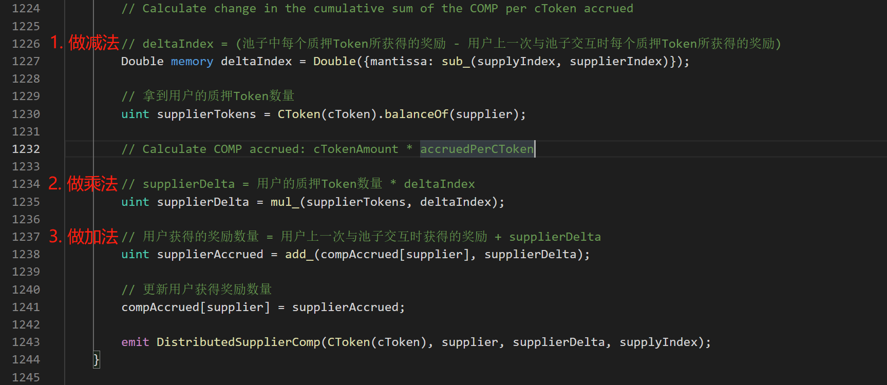

在`_InitializeMarket()`函数中`supplyState.index`被初始化为1e36,也就是`当前池子中每个质押Token所获得的奖励`被初始化为1e36

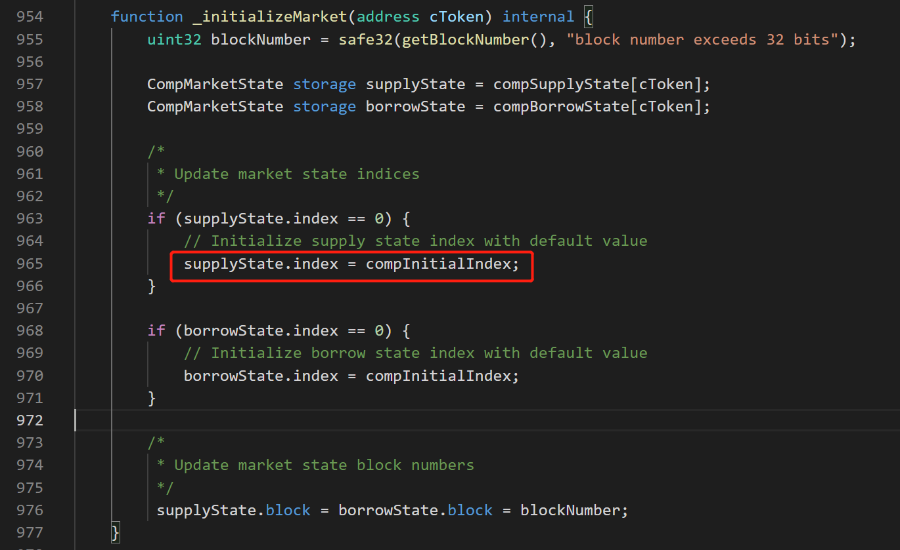
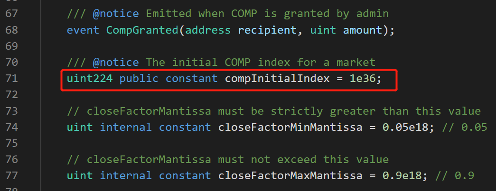

所以`supplyIndex = supplyState.index = comInitialIndex = 1e36`

由于` cTUSD、cMKR、cSUSHI、cYFI、cAAVE和cSAI` 不应该获得任何`Comp`奖励,所以开发者理论上希望`supplierIndex`也等于`1e36`
这样 `deltaIndex = supplyIndex - supplierIndex = 1e36 - 1e36 = 0`,用户的奖励会被计算为0

但在`if`语句中,少了一个等号`=`,由于`supplyIndex = comInitialIndex = 1e36`并不符合判断条件`supplyIndex > comInitialIndex`, `supplierIndex`没有被初始化为`1e36`,其值依然为`0`

[Compund github 仓库中关于此处的提交修改](https://github.com/compound-finance/compound-protocol/commit/fcf067f6fa50a93ff9125f5f0abae0ae98d1e8b0#diff-8ef9294768226293f278525b40998f11db7ee32464279f47ca7ad35294bb6a3fL1217)


所以最终的奖励计算变成了

```
// 用户获得的奖励数量 = 用户的质押Token数量 
//                     * 
//                    (当前池子中每个质押Token所获得的奖励 - 0) 
//                     + 
//                    用户上一次与池子交互时获得的奖励
```

最终导致了悲剧的发生